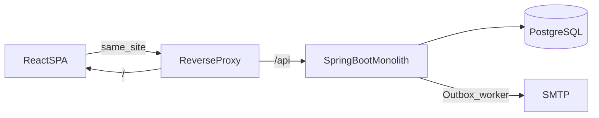
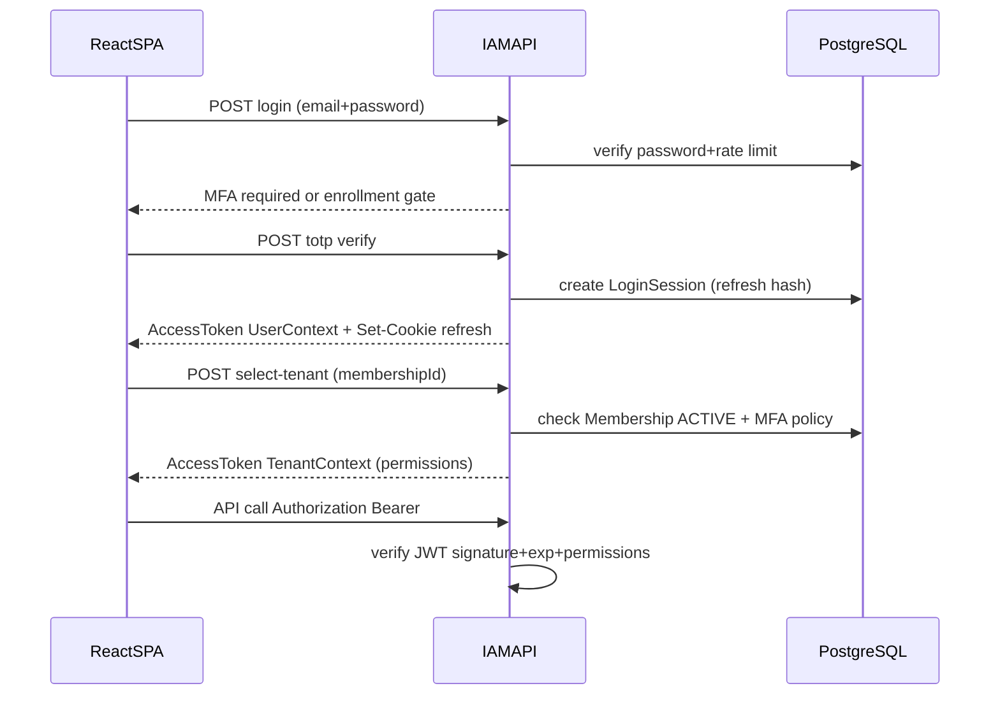

# RoseCloud IAM Architecture

实现视角说明。领域词汇见 [`../CONTEXT.md`](../CONTEXT.md)，行为契约见 [`spec/iam-v1.md`](spec/iam-v1.md)。

## 1. System shape



- 仓库：`rosecloud-iam`（本机路径规划：`/Users/zhijunio/github/rosecloud-iam`）。
- 布局：仓库根为后端；含 `docs/`、`frontend/`。非两个独立 Git 库。
- 后端：单个 Spring Boot **4.1.0** 应用（Maven Wrapper）、Java 25、包名 `io.rosecloud.iam`。
- 前端：React + TypeScript + Vite；语义化 HTML + CSS Modules；无大型组件库。
- OpenAPI 为契约源；CI 用生成的 TypeScript 客户端防止漂移。
- 其余依赖小版本跟随 Spring Boot 4.1.0 BOM；非 BOM 依赖建仓时再锁定。

## 2. Modular monolith

单工程、单数据库；用领域包 + package-private + ArchUnit 强制边界（不用 Maven 多模块强拆、首版不用 Spring Modulith）。

建议包结构（实现时可微调命名，不可打破依赖方向）：

```text
io.rosecloud.iam
  bootstrap          # 启动、安全过滤器装配、全局异常
  shared             # 无业务偏好的 ID、错误、时钟、加密原语适配
  identity           # User、Credential、TOTP、恢复码、密码策略
  operator           # PlatformOperator、setup token、离线 CLI
  tenancy            # Tenant、Membership、Invitation
  access             # Role、Permission 目录、绑定与判定
  session            # LoginSession、Refresh 轮换、JWT 签发校验
  audit              # AuditEvent 追加与查询（管理侧后续）
  delivery           # Outbox、邮件发送
  api                # REST 适配器（DTO）；不承载领域规则
```

依赖规则：

- `api` → 各领域应用服务；不得反向。
- 领域包之间只通过显式应用服务 / 领域事件契约协作；禁止跨包直接使用 Entity/Repository。
- JPA Entity 不出模块边界；列表接口使用投影或显式 fetch。
- 关闭 Open Session in View。
- 默认 `FetchType.LAZY`；关键路径附查询数回归测试。

## 3. Data ownership

权威状态全部在 PostgreSQL 单库：

| 数据 | 所有者模块 |
| --- | --- |
| User、密码哈希、TOTP 密文、恢复码哈希 | identity |
| PlatformOperator 与 setup | operator |
| Tenant、Membership、Invitation | tenancy |
| Role、Role-Permission、Membership-Role | access |
| LoginSession、refresh token hash、会话族 | session |
| AuditEvent | audit |
| Outbox 消息 | delivery |

- 主键：UUIDv7，对外与对内统一（不做 bigint + UUID 双标识）。
- 租户隔离：共享 schema；租户相关表显式 `tenant_id`；复合唯一键 / 外键；Repository 边界测试。**首版不做 RLS / schema-per-tenant。**
- Schema 变更：Flyway SQL migration；生产 `ddl-auto=validate`（或等价：禁止 Hibernate 自动改表）。

## 4. AuthN / AuthZ request flow



要点：

- Refresh Cookie 同站点；AccessToken 内存持有。
- Refresh 竞态：短宽限返回可重试；窗外复用撤销会话族。
- 授权：Resource Server 校验 JWT；业务注解/守卫检查 Permission code。
- 5 分钟陈旧窗口为显式权衡，不做每请求 introspection（除非未来高风险路径另议）。

## 5. Permission catalog

- 各模块在代码中声明 `Permission` 元数据（code、描述、模块归属）。
- 启动或迁移阶段由 access 模块汇总入库/缓存，供角色配置 UI 选择。
- 未知 Permission 永不被「管理员手写字符串」创造出来。

## 6. Transactional outbox

邀请、验证、重置等邮件：

1. 业务事务内写业务行 + `outbox` 行。
2. 后台轮询/调度发送 SMTP。
3. 成功标记；失败指数退避；幂等键防止重复邮件副作用失控。

## 7. Secrets and crypto

| 材料 | 策略 |
| --- | --- |
| 密码 | 仅哈希（DelegatingPasswordEncoder / Argon2id 默认） |
| Refresh Token | 仅哈希 |
| 恢复码 | 仅哈希 |
| TOTP Secret | AEAD 密文 + `key_id` |
| JWT | RS256 私钥在库外；JWKS 发布公钥 |

## 8. Frontend deployment

- 开发：Vite dev server + 代理 `/api`。
- 生产：静态资源与 API 由同一站点入口分流（nginx/Caddy 等）；避免跨站 Cookie。
- 首切片页面：Operator setup/登录、创建 Tenant、接受邀请、绑定 TOTP、登录、选择 Tenant、邀请成员、简单允许/拒绝演示页。

## 9. Operability

- 单实例：滚动发布会有短暂中断；接受。
- 备份：持续 WAL 归档，RPO ≤ 5 分钟；恢复演练证明 RTO ≤ 1 小时。
- 引导：离线 CLI 发放一次性 Operator setup token；灾难 MFA 重置同为本地 CLI。
- 审计查询 UI 可后置；写路径不可后置。

## 10. Related ADRs

- [0001 Modular monolith and single PostgreSQL](adr/0001-modular-monolith-single-postgres.md)
- [0002 Global User and multi-tenant Membership](adr/0002-global-user-multi-tenant-membership.md)
- [0003 Short Access JWT and rotating refresh](adr/0003-short-access-jwt-rotating-refresh.md)
